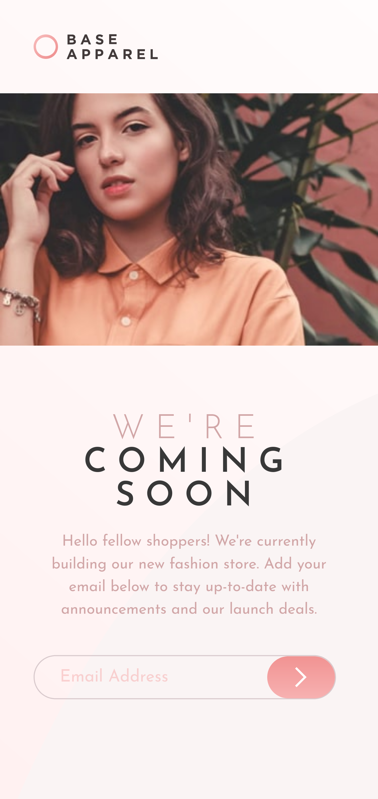

# Base apparel coming soon page

This is a exercise from frontendmentor.io.It's a simple landing page of Base apparel company.

## Table of Contents

- [General Info](#general-information)
- [Technologies Used](#technologies-used)
- [Features](#features)
- [Screenshots](#screenshots)
- [Setup](#setup)
- [Project Status](#project-status)
- [Contact](#contact)

## General Information

Base Apparel coming soon page

## Technologies Used

- React js
- Vite
- JSX
- Css

## Screenshots

Screenshoot:Desktop view

Screenshoot:Mobile view

## Setup

Start with clone the project from github.Then open your terminal or cmd and type:

`npm install`

It will install all the required package to run this project.Then type:

`npm run dev`

It will start the project on http://localhost:5173/ .Got to any browser ,type
this link and visit.

## Project Status

Project is: _complete_

## Contact

Created by [@ZTanvir](https://github.com/ZTanvir) - feel free to contact me!
